# Credit_Risk_Analysis

## Overview of the analysis: Explain the purpose of this analysis.
The purpose of this analysis is to apply machine learning to solve challenges in credi card risk field. 
In order to predict credit risk, it is going to be compare two new machine learning models that reduce bias. After that, the performance of these models will be evaluated to determine if those should be used to predict credit risk.

## Results: Using bulleted lists, describe the balanced accuracy scores and the precision and recall scores of all six machine learning models. Use screenshots of your outputs to support your results.

### Oversampling

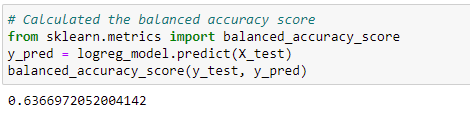 

The balanced accuracy score is 0.64. 

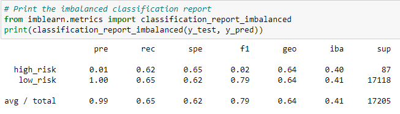

The high risk precision score is 0.01 and sensitivity score is 0.62, which makes an f-score of 0.02. 
### SMOTE

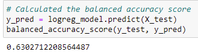 

The balanced accuracy score is 0.63. 

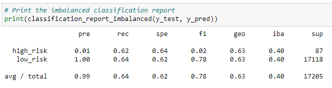

The high risk precision score is 0.01 and sensitivity score is 0.62, which makes an f-score of 0.02. 

### Undersampling

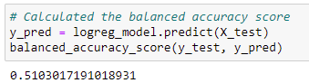 

The balanced accuracy score is 0.51. 

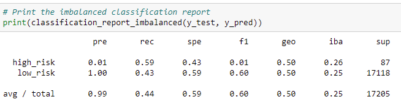

The high risk precision score is 0.01 and sensitivity score is 0.59, which makes an f-score of 0.01. 

### Combination Sampling

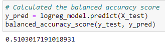

The balanced accuracy score is 0.51.

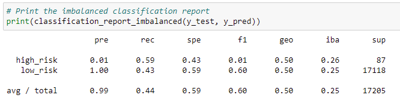

The high risk precision score is 0.01 and sensitivity score is 0.59, which makes an f-score of 0.01. 

### Balanced Random Forest Classifier

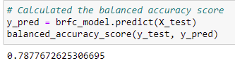 

The balanced accuracy score is 0.79. 

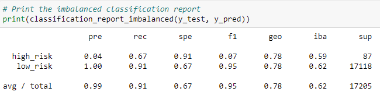

The high risk precision score is 0.04 and sensitivity score is 0.67, which makes an f-score of 0.07. 

### Easy Ensemble AdaBoost Classifier

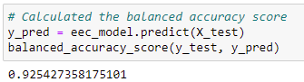 

The balanced accuracy score is 0.93. 

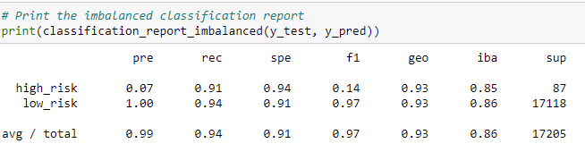

The high risk precision score is 0.07 and sensitivity score is 0.91, which makes an f-score of 0.14.

* In all of the models, we can see that the precision and sensitivity score for low risk are higher. It is because the low number of false positives due the higher number of low risk population.

## Summary: Summarize the results of the machine learning models, and include a recommendation on the model to use, if any. If you do not recommend any of the models, justify your reasoning.

In conclusion, the performance of models presented showed a weak precision finding if the credit risk is high, but the overall accuracy scores of models were higher due the fact there are higher low risk population. Also, as we can see, even if the best model was Easy Ensemble AdaBoost Classifier with an average F-score of 0.97 and balanced accuracy score of 0.93, the high risk average F-score was 0.14 though. This means that the model is not as good enough predicting high risk. Therefore, it is strongly recommended avoid using any of these models.

